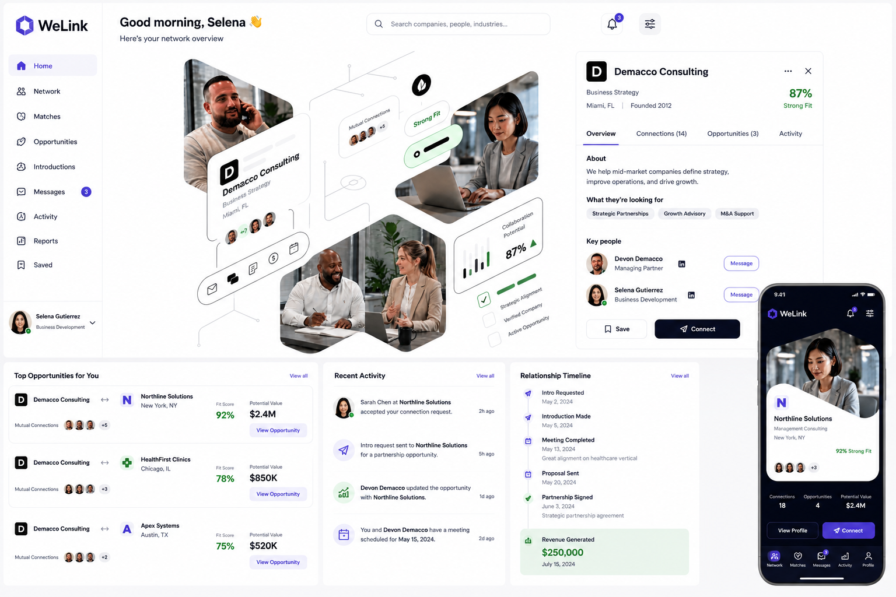
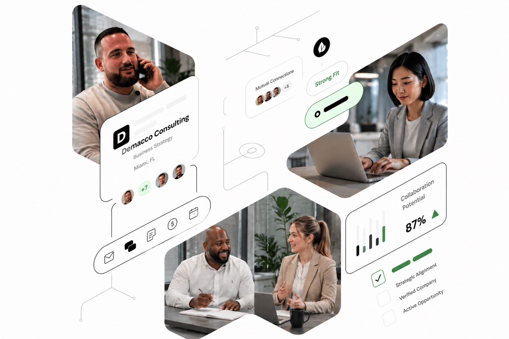

# WeLink Demo

A polished demo experience for exploring relationship-driven business development inside a modern network dashboard.



## Why WeLink

Most CRM interfaces are excellent at storing records and weak at surfacing relationship momentum.

WeLink is positioned as a relationship intelligence layer for business development teams that need to answer questions like:

- who is the strongest-fit introduction target right now
- where warm paths already exist across the network
- which companies are strategically aligned before time is spent on outreach
- how opportunity value and relationship strength should be evaluated together

The demo focuses on turning that abstract value proposition into a visual product experience.

## Gallery

### Experimental Card Direction



## What This Is

WeLink Demo is a Next.js app that packages three complementary flows:

- a branded landing and login experience
- a signed-in dashboard with an interactive company network map
- an experimental visual network page with flipping profile cards and drill-in profile routes

The project is designed as a product-style prototype rather than a bare scaffold. The emphasis is on visual clarity, relationship discovery, and high-signal opportunity surfacing.

## Highlights

- Interactive network dashboard with selectable companies and contextual detail panels
- Experimental collage-style network view with flip-card interactions
- Dynamic profile routes for selected experimental nodes
- Tailwind CSS 4 styling with custom flip-card motion
- Shared mock datasets for companies, contacts, fit scores, and opportunity value
- App Router structure ready for continued product iteration

## Routes

- `/` — landing/login screen
- `/dashboard` — main signed-in network dashboard
- `/dashboard/experimental` — experimental visual network view
- `/dashboard/experimental/[companyId]` — mock company/profile detail pages

## Tech Stack

- Next.js 16
- React 19
- TypeScript
- Tailwind CSS 4
- ESLint
- Framer Motion
- Lucide React

## Getting Started

Install dependencies:

```bash
npm install
```

Start the development server:

```bash
npm run dev
```

Open `http://localhost:3000` in your browser.

## Deployment

### Vercel

The fastest path is deploying with Vercel:

1. Import the GitHub repository into Vercel.
2. Accept the default Next.js build settings.
3. Deploy.

### Manual Production Build

To verify the app locally in production mode:

```bash
npm run build
npm run start
```

Then open `http://localhost:3000`.

## Available Scripts

```bash
npm run dev
npm run build
npm run start
npm run lint
```

## Project Structure

```text
app/
	page.tsx                          # Landing/login experience
	dashboard/
		page.tsx                        # Main network dashboard
		experimental/
			page.tsx                      # Experimental visual map
			[companyId]/page.tsx          # Dynamic profile details
components/
	auth/                             # Login form UI
	marketing/                        # Hero and landing visuals
	network/                          # Network map, node cards, datasets
public/                             # Logos and profile imagery
```

## Design Direction

This demo leans into:

- clean white surfaces with soft slate borders
- dense but readable business intelligence cards
- relationship-first visual metaphors instead of traditional tables
- exploratory motion patterns for profile discovery

## Notes

- Data is currently mocked for demo purposes.
- The experimental route is intentionally more visual and less system-constrained than the main dashboard.
- Product copy, opportunity metrics, and people lists are placeholders that can be wired to a real backend later.

## Next Build-Out Ideas

- Persist selected companies and saved opportunities
- Add authentication and user-specific workspaces
- Back the network graph with live CRM or partner data
- Introduce filters for geography, industry, and fit score
- Add analytics around introductions, conversions, and relationship strength

## Repository

GitHub: https://github.com/Welink-pixie/welink-demo
